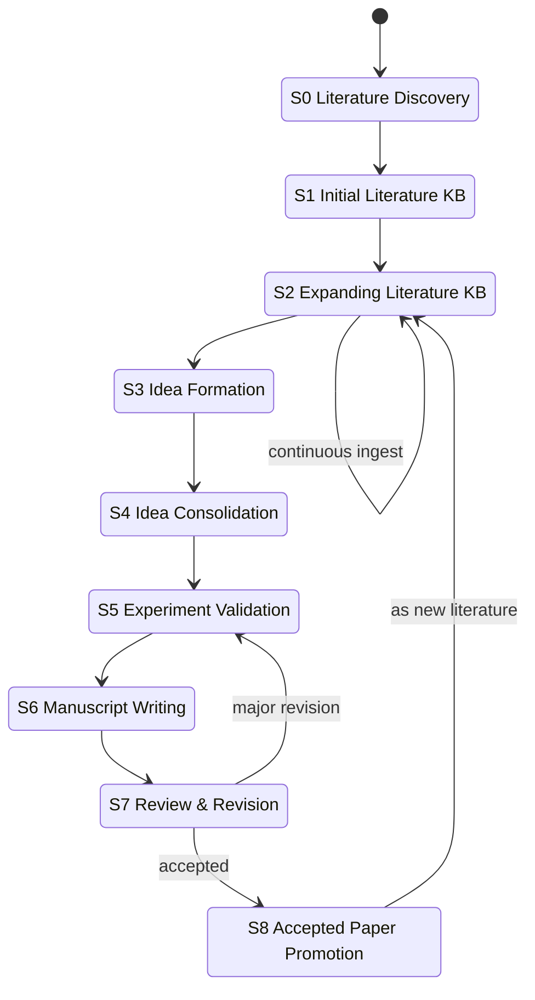

<div align="center">

# Research-Wiki

### Literature-Grounded Research Lifecycle Wiki

**A long-horizon research operating system — not another notes app.**

Strict separation between *public literature* and *unpublished research*, with accepted papers as the only legal feedback path.

[](./.github/workflows/ci.yml)
[](https://www.python.org/)
[](./LICENSE)
[](./docs)
[](./AGENTS.md)

[English](./README.md) · [简体中文](./README.zh-CN.md) · [Docs](./docs) · [CLI Reference](./docs/cli-reference.md) · [Quick Start](#quick-start)

<sub><i><b>Research-Wiki</b> is the project you see on GitHub &middot; <b>LGRLW</b> is the underlying protocol &middot; <code>lgrlw</code> is the Python package and CLI &mdash; all three refer to the same thing from different angles.</i></sub>

</div>

---

> **Current status &mdash; v0.2.0 released; v0.3 in development on `develop/v0.3`.** v0.1 shipped the three-space scaffold and the base CLI. **v0.2.0** added four networked metadata fetchers (`--doi` Crossref / `--arxiv` arXiv Atom / `--openalex` OpenAlex Works / `--ss` Semantic Scholar Graph), plus the **promotion ceremony** (`lgrlw promote`) that atomically lifts an accepted workspace paper into the KB with paper card + metadata + BibTeX. **v0.3 (in development)** adds a built-in **MCP server** (`lgrlw mcp serve`) so agents (Claude Code, Cursor, Windsurf) can call every CLI command over the Model Context Protocol, and **multi-direction monorepo support** so a single git repo can host several research directions side by side under `directions/<slug>/`. **PDF &rarr; Markdown conversion** remains a `Later` roadmap item. See the [Roadmap](#roadmap).

---

## Why this exists

Most research-notes tooling (Zotero, Notion, Obsidian, raw RAG pipelines) conflates three fundamentally different things:

1. **Public literature** — what the field has published.
2. **Your unpublished research** — ideas, methods, experiments, drafts.
3. **The paper you are writing** — a *staged product* of the above two.

When these mix, your knowledge base slowly drifts toward "the story that supports my current paper" instead of "the actual state of the field". Over years this silently corrupts every future literature review, citation plan, and related-work section you produce.

**Research-Wiki enforces the separation as an invariant**, not a convention.

> Literature KB grows from external literature.
> Research Workspace grows from KB guidance and experimental validation.
> Manuscript grows from Workspace plus dated KB exports.
> Accepted manuscript returns to Literature KB — as literature.

This is the minimum viable protocol for a **long-horizon, compounding, agent-operable** research knowledge base.

---

## Three-space architecture

```mermaid
flowchart LR
    subgraph KB["Literature KB (public)"]
        direction TB
        KB1[Papers]
        KB2[Field Structure]
        KB3[Evidence / Claims]
        KB4[Concepts / Taxonomy]
    end

    subgraph WS["Research Workspace (private)"]
        direction TB
        WS1[Idea Sandbox]
        WS2[Method Design]
        WS3[Experiments]
        WS4[Manuscript]
        WS5[Review / Rebuttal]
    end

    subgraph PR["Promotion Pipeline"]
        direction TB
        PR1[Acceptance Record]
        PR2[Final Metadata]
        PR3[KB Promotion]
    end

    KB -- "dated export pack" --> WS
    WS -- "accepted paper only" --> PR
    PR -- "promote()" --> KB
    WS -. "read-only" .-> KB
```



| Space | Role | Writeable by | Entry rule |
|---|---|---|---|
| **Literature KB** | Public state of the field | External ingest + `promote` | Only published / accepted work |
| **Research Workspace** | Your private research generation process | You + your agents | Any idea, hypothesis, result |
| **Promotion Pipeline** | One-way gate back into KB | `lgrlw promote` | `paper_status = accepted` |

The KB is **append-only with respect to your own in-flight research**. The only legal backflow is an *accepted paper*.

---

## The 9-stage research lifecycle



Every stage has an explicit directory location, a set of allowed artifacts, and a lint rule that keeps cross-space leaks from happening. See [`docs/lifecycle.md`](./docs/lifecycle.md).

---

## What makes this different

- **Boundary as code, not convention.** `lgrlw lint` fails CI when your workspace accidentally writes into the KB, when a paper frontmatter claims `status: accepted` without a DOI/arXiv/venue, or when an export pack's manifest diverges from its contents.
- **Agent-first design.** Each space ships with an [`AGENTS.md`](./templates/literature-kb/00_System/KB_AGENTS.md) *constitution* that LLM agents (Claude Code, Cursor, Windsurf, Aider) read and obey. See [`docs/agents-guide.md`](./docs/agents-guide.md).
- **Dated, immutable export packs.** Every paper draft is grounded in a specific KB snapshot (`06_Exports/paper_XXX_YYYY-MM-DD/`) with a signed manifest, so your related-work section is reproducible from the KB state at writing time — even after the KB keeps growing.
- **Promotion is a ceremony, not a copy.** `lgrlw promote` (v0.2) validates `paper_status: accepted`, final title / authors / venue / year, at least one of DOI / arXiv, a camera-ready artifact in `06_Promotion/final_metadata.md`, and a fully-ticked `06_Promotion/promotion_checklist.md`; then it atomically emits a paper card (`source: promoted`), a metadata snapshot, a BibTeX entry, and an audit log line. The Field Structure / Evidence Map / Method Taxonomy updates listed in `06_Promotion/add_back_to_kb_plan.md` remain a manual follow-up, deliberately, so a human makes the taxonomy call.
- **Works offline, local-first, Obsidian-compatible.** Pure Markdown + YAML frontmatter. Your knowledge does not live in someone else's SaaS.
- **Small, typed, tested core.** Python 3.10+, pydantic v2, Typer, and `httpx` (used only by the four networked fetchers, each covered by `respx`-mocked tests). No database. No lock-in.

---

## Quick start

### Install

```bash
pip install lgrlw                   # from PyPI (once published)
# or, for the current dev version:
pip install git+https://github.com/ConmuYan/Research-Wiki.git
```

Or clone and install editable:

```bash
git clone https://github.com/ConmuYan/Research-Wiki.git
cd research-wiki
pip install -e ".[dev]"
```

### Bootstrap a new research direction

```bash
lgrlw init ./my-research --direction "efficient-llm-inference"
```

This creates:

```
my-research/
├── literature-kb/          # public literature, append-only for in-flight work
├── research-workspaces/    # your private ideas, methods, manuscripts
└── .lgrlw.toml             # project config
```

### Add a paper to the KB

Manual entry (any version):

```bash
lgrlw add-literature --manual \
  --title "Self-RAG: Learning to Retrieve, Generate, and Critique through Self-Reflection" \
  --authors "Akari Asai, Zeqiu Wu, Yizhong Wang, Avirup Sil, Hannaneh Hajishirzi" \
  --year 2023 \
  --venue "ICLR 2024" \
  --arxiv 2310.11511 \
  --tags "rag,llm,retrieval"
```

Networked ingestion (v0.2, mutually exclusive per invocation):

```bash
# Crossref (DOI)
lgrlw add-literature --doi 10.48550/arxiv.2310.11511

# arXiv Atom API
lgrlw add-literature --arxiv 2310.11511

# OpenAlex Works
lgrlw add-literature --openalex W4385545131

# Semantic Scholar Graph API (paperId, DOI:, ARXIV:, CorpusId:, or S2 URL all accepted)
lgrlw add-literature --ss 649def34f8be52c8b66281af98ae884c09aef38b
```

Output: a paper card at `literature-kb/02_Literature/Papers/<slug>.md` and a JSON metadata snapshot in `literature-kb/01_Raw/metadata/<slug>.json`. The polite-pool environment variables `CROSSREF_MAILTO`, `OPENALEX_EMAIL`, and `S2_API_KEY` are honoured when set. Auto-generated BibTeX ships together with `lgrlw promote` (not `add-literature`) in v0.2.

Attach a local PDF in the same call (v0.3.1+, no network):

```bash
lgrlw add-literature --arxiv 2310.11511 --pdf ./papers/self-rag.pdf
# copies the PDF verbatim to literature-kb/01_Raw/pdf/<paper_id>.pdf
```

### Batch import from BibTeX (v0.4)

```bash
pip install "lgrlw[bib]"

lgrlw import-bib refs.bib \
  --pdf-dir ./papers \
  --on-duplicate skip \
  --tags "rag,llm"
# → creates cards for every entry
# → matches local PDFs by arxiv id / cite key / paper-id slug
# → writes literature-kb/01_Raw/imports/<run_id>/manifest.json + source.bib
```

Offline, deterministic, and never touches the network. See
[`docs/import-bib.md`](./docs/import-bib.md) for the full protocol.

### Start a paper workspace

```bash
lgrlw new-workspace paper_001 --kind paper --title "Your working title"
```

### Export a grounded evidence pack for writing

```bash
lgrlw export-pack paper_001
# → literature-kb/06_Exports/paper_001_2026-05-02/ (immutable, hashed)
# → copied into research-workspaces/paper_001/01_KB_Exports/
```

### Check the boundary invariants

```bash
lgrlw lint
# ✓ frontmatter schemas
# ✓ no workspace writes leaked into literature-kb/
# ✓ every export_manifest.json matches its pack contents
# ✓ every accepted paper has final metadata
```

### After acceptance (v0.2)

```bash
lgrlw promote paper_001
```

Once your workspace's `00_Project/paper_status.md` has `status: accepted`, full final metadata, and a ticked `06_Promotion/promotion_checklist.md`, `lgrlw promote` atomically writes:

- a paper card at `literature-kb/02_Literature/Papers/<id>.md` with `source: promoted`;
- a metadata snapshot at `literature-kb/01_Raw/metadata/<id>.json`;
- an auto-generated BibTeX entry at `literature-kb/01_Raw/bibtex/<id>.bib` (`@inproceedings` when `venue` is set, `@misc` otherwise);
- an audit line in `literature-kb/00_System/log.md`.

The full protocol — preconditions, error messages, and which taxonomy edits remain manual follow-ups — lives in [`docs/promotion-protocol.md`](./docs/promotion-protocol.md).

See [`docs/cli-reference.md`](./docs/cli-reference.md) for every command.

---

## Repository layout

```
research-wiki/
├── src/lgrlw/              # Python package & CLI
│   ├── cli.py              # Typer entrypoint
│   ├── commands/           # init / add-literature / export-pack / promote / lint / ...
│   ├── fetchers/           # arxiv · openalex · semantic_scholar · crossref
│   ├── lint/               # boundary · schema · links
│   ├── schemas.py          # pydantic v2 models for frontmatter
│   └── render/             # Jinja paper-card renderer
├── templates/
│   ├── literature-kb/      # KB skeleton + 00_System/*.md protocol docs
│   └── research-workspace/ # paper_template/ + idea_template/
├── schemas/                # JSON schemas mirroring pydantic models
├── docs/
│   ├── architecture.md
│   ├── lifecycle.md        # 9-stage state machine in detail
│   ├── boundary-rules.md   # what can cross, what cannot
│   ├── export-protocol.md  # how a snapshot is built
│   ├── promotion-protocol.md
│   ├── agents-guide.md     # for LLM agents operating on this repo
│   └── cli-reference.md
├── examples/
│   └── demo_direction/     # a tiny, already-populated KB for tour purposes
├── tests/                  # pytest suite
└── AGENTS.md               # top-level constitution
```

---

## The contract you are signing up for

Writing into `literature-kb/` is **only** permitted from:

1. `lgrlw add-literature` (external literature)
2. `lgrlw promote` (your own accepted paper)
3. Manual curation of Field Structure / Evidence Map that references **already-in-KB** papers

Every other write — ideas, hypotheses, experiment logs, draft claims, rebuttal notes, unaccepted contributions — belongs in `research-workspaces/<project>/`.

`lgrlw lint` enforces this. CI enforces lint. See [`docs/boundary-rules.md`](./docs/boundary-rules.md) for the full policy, including the handful of edge cases (reviewer-suggested literature, preprints you explicitly approve, etc.).

---

## Roadmap

**v0.1 — shipped (MVP local loop, no network)**

- [x] Three-space scaffold templates (`literature-kb/`, `research-workspaces/`)
- [x] CLI: `init`, `new-workspace`, `add-literature --manual`, `export-pack`, `lint`
- [x] Boundary + schema + manifest lint (all three strengthening over time)
- [x] Dated, immutable export packs with SHA-256 manifest
- [x] Worked `examples/demo_direction/` that `lint` + `export-pack` cleanly

**v0.2 &mdash; shipped (networked literature ingestion + promotion ceremony)**

- [x] Networked fetchers under `lgrlw.fetchers`: Crossref (`--doi`), arXiv (`--arxiv`), OpenAlex (`--openalex`), Semantic Scholar (`--ss`), each with `respx`-mocked tests and a polite-pool environment variable
- [x] `lgrlw promote` acceptance ceremony (atomic paper card + metadata + BibTeX + log line; preconditions enforced per [`docs/promotion-protocol.md`](./docs/promotion-protocol.md))
- [x] Auto-generated BibTeX on promotion (`@inproceedings` / `@misc`)
- [x] Repo-wide LF normalisation (`.gitattributes` + explicit `newline="\n"` on every write path) so export-pack SHA-256 digests stay stable across Windows and Linux

**v0.3 &mdash; in development on `develop/v0.3`**

- [x] **MCP server** (`lgrlw mcp serve`) exposing every CLI command (`init_project`, `new_workspace`, `add_literature`, `export_pack`, `promote`, `lint`, `add_direction`) plus read-only KB / workspace resources, so agents (Claude Code, Cursor, Windsurf) can drive Research-Wiki over the Model Context Protocol. Optional dependency: `pip install "lgrlw[mcp]"`. See [`docs/mcp-server.md`](./docs/mcp-server.md).
- [x] **Multi-direction monorepo support** &mdash; a single repo can host several research directions under `directions/<slug>/`. New CLI: `lgrlw init --monorepo`, `lgrlw add-direction <slug>`, and a `--direction <slug>` selector on every project-scoped command. `lgrlw lint` recursively checks every direction. See [`docs/monorepo.md`](./docs/monorepo.md).

**Later**

- [ ] MinerU integration for PDF &rarr; Markdown (plugin; `pip install "lgrlw[mineru]"`)
- [ ] Zotero bidirectional sync (plugin)
- [ ] Obsidian graph / Dataview helpers
- [ ] Web dashboard (read-only) for taxonomy & evidence maps

See [open issues](https://github.com/ConmuYan/Research-Wiki/issues) and [`CHANGELOG.md`](./CHANGELOG.md).

---

## Contributing

We welcome contributions that sharpen the boundary semantics, add new fetchers, improve the lint rules, or provide better agent prompts for specific LLMs. Please read [`CONTRIBUTING.md`](./CONTRIBUTING.md) and [`CODE_OF_CONDUCT.md`](./CODE_OF_CONDUCT.md) first.

## Acknowledgements

The persistent-wiki-over-ephemeral-RAG thesis is owed to AJ Calegari's writing on compounding LLM knowledge bases. The strict-boundary discipline and the accepted-paper-promotion ceremony are this project's contribution on top of that thesis.

## License

[MIT](./LICENSE) © 2026 LGRLW contributors.
