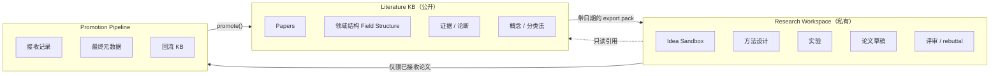
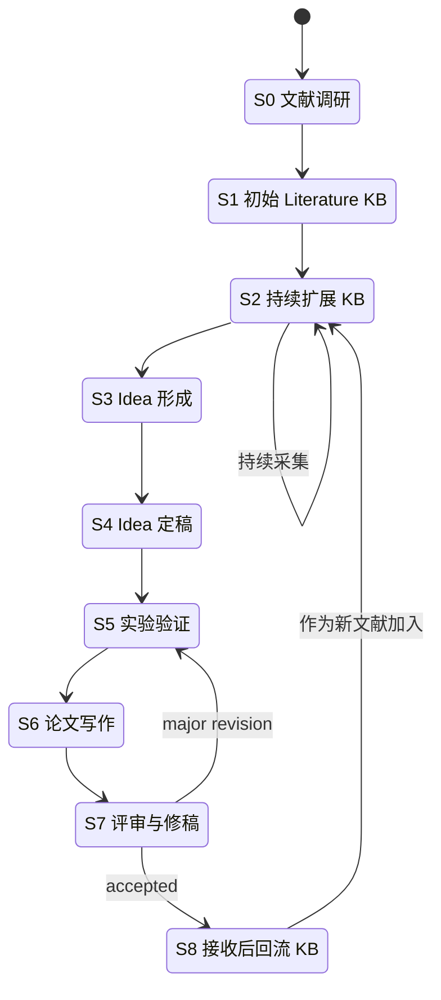

<div align="center">

# Research-Wiki

### 文献驱动的研究生命周期知识库

**不是又一个笔记工具，而是一套长期研究操作系统。**

严格分离「公开文献世界」与「我未发表的研究过程」，仅允许已接收论文作为回流节点。

[](./.github/workflows/ci.yml)
[](https://www.python.org/)
[](./LICENSE)
[](./docs)
[](./AGENTS.md)

[English](./README.md) · [简体中文](./README.zh-CN.md) · [文档](./docs) · [CLI 手册](./docs/cli-reference.md) · [快速开始](#快速开始)

<sub><i><b>Research-Wiki</b> 是 GitHub 上的项目名 · <b>LGRLW</b> 是底层协议名 · <code>lgrlw</code> 是 Python 包与 CLI 入口 — 三者指同一件事的不同角度。</i></sub>

</div>

---

> **当前状态 — v0.2 开发中（`develop/v0.2` 分支）。** v0.1 已交付三空间脚手架、基础 CLI（`init`、`new-workspace`、`add-literature --manual`、`export-pack`、`lint`）、完整边界不变量，以及带 SHA-256 manifest 的导出快照。**v0.2 新增四条网络 fetcher**（`--doi` 走 Crossref、`--arxiv` 走 arXiv Atom、`--openalex` 走 OpenAlex Works、`--ss` 走 Semantic Scholar Graph API），以及 **Promotion 仪式**（`lgrlw promote`）：原子化地把已接收工作区论文以 paper card + metadata + BibTeX 一次性回流到 KB。**PDF → Markdown 转换** 仍在 `后续` 路线图里。见 [路线图](#路线图)。

---

## 为什么需要它

大多数研究笔记工具（Zotero、Notion、Obsidian、裸 RAG 管线）把三件本质不同的事混在一起：

1. **公开文献** —— 领域已经发表的东西。
2. **我未发表的研究** —— 我的 idea、方法草图、实验、草稿。
3. **当前正在写的论文** —— 前两者的阶段性产物。

一旦混起来，你的知识库就会缓慢滑向「支撑我这篇论文的叙事」，而不是「领域真实的现状」。几年之后，你之后所有的文献综述、引用规划、Related Work 都会被这种污染悄悄腐蚀。

**Research-Wiki 把这条分界线作为不变量 (invariant) 来执行，而不是靠自觉。**

> 文献库由外部文献持续扩展；
> 研究工作区由文献库指导并通过实验验证逐渐成熟；
> 论文由工作区与带日期的 KB 导出共同生成；
> 被接收后的论文再作为正式文献回流到文献库。

这是一个**长期复利、agent 可操作**的研究知识库所需的最小协议。

---

## 三空间架构



| 空间 | 职责 | 谁可以写 | 准入规则 |
|---|---|---|---|
| **Literature KB** | 研究方向的公开文献状态 | 外部采集 + `promote` | 仅已发表 / 已接收 |
| **Research Workspace** | 我的私有研究生成过程 | 我 + 我的 agent | 任意 idea、假设、结果 |
| **Promotion Pipeline** | 回流 KB 的单向闸门 | `lgrlw promote` | `paper_status = accepted` |

**对你自己当前未发表工作而言，KB 是只追加的。** 唯一合法的回流路径是「已接收的论文」。

---

## 九阶段研究生命周期



每个阶段都有明确的目录位置、允许产物清单与一条对应的 lint 规则。详见 [`docs/lifecycle.md`](./docs/lifecycle.md)。

---

## 核心差异

- **边界即代码，不是自觉。** `lgrlw lint` 会在 workspace 意外写入 KB、`status: accepted` 却没有 DOI/arXiv/venue、或者 export 包的 manifest 与实际内容不一致时直接让 CI 失败。
- **Agent-first 设计。** 每个空间都自带一份 [`AGENTS.md`](./templates/literature-kb/00_System/KB_AGENTS.md) *宪法*，供 LLM agent（Claude Code / Cursor / Windsurf / Aider）读取并遵守。详见 [`docs/agents-guide.md`](./docs/agents-guide.md)。
- **带日期的不可变 export pack。** 每份论文草稿都锚定在一个具体的 KB snapshot（`06_Exports/paper_XXX_YYYY-MM-DD/`）上，含签名 manifest，让你的 Related Work 在 KB 持续扩展之后依然可复现。
- **Promotion 是一次仪式，不只是复制。** `lgrlw promote`（v0.2）校验 `paper_status: accepted`、最终 title/authors/venue/year、至少一个 DOI/arXiv、`06_Promotion/final_metadata.md` 中的 camera-ready 产物，以及 `06_Promotion/promotion_checklist.md` 全部打勾；通过后原子化地产出带 `source: promoted` 的 paper card、metadata 快照、BibTeX 条目与审计 log。`06_Promotion/add_back_to_kb_plan.md` 里列的 Field Structure / Evidence Map / Method Taxonomy 改动仍由你手动后续 commit —— 有意保留给人来做分类决策。
- **离线、本地优先、Obsidian 兼容。** 纯 Markdown + YAML frontmatter。你的知识不会住在别人的 SaaS 上。
- **小而类型化、带测试的核心。** Python 3.10+、pydantic v2、Typer，以及 `httpx`（仅在四条网络 fetcher 里使用，每条都有 `respx` mock 测试）。没有数据库，没有 lock-in。

---

## 快速开始

### 安装

```bash
pip install lgrlw                     # 发布到 PyPI 后
# 或安装开发版：
pip install git+https://github.com/ConmuYan/Research-Wiki.git
```

或者 clone 后以开发模式安装：

```bash
git clone https://github.com/ConmuYan/Research-Wiki.git
cd research-wiki
pip install -e ".[dev]"
```

### 初始化一个研究方向

```bash
lgrlw init ./my-research --direction "efficient-llm-inference"
```

会创建：

```
my-research/
├── literature-kb/          # 公开文献，对你在研工作只追加
├── research-workspaces/    # 你的 idea、方法、论文草稿
└── .lgrlw.toml             # 项目配置
```

### 添加一篇文献到 KB

手录（任何版本都支持）：

```bash
lgrlw add-literature --manual \
  --title "Self-RAG: Learning to Retrieve, Generate, and Critique through Self-Reflection" \
  --authors "Akari Asai, Zeqiu Wu, Yizhong Wang, Avirup Sil, Hannaneh Hajishirzi" \
  --year 2023 \
  --venue "ICLR 2024" \
  --arxiv 2310.11511 \
  --tags "rag,llm,retrieval"
```

联网抓取（v0.2，每次只能选一条网络源）：

```bash
# Crossref (DOI)
lgrlw add-literature --doi 10.48550/arxiv.2310.11511

# arXiv Atom API
lgrlw add-literature --arxiv 2310.11511

# OpenAlex Works
lgrlw add-literature --openalex W4385545131

# Semantic Scholar Graph API（40-hex paperId / DOI: / ARXIV: / CorpusId: / S2 URL 都可）
lgrlw add-literature --ss 649def34f8be52c8b66281af98ae884c09aef38b
```

产物：`literature-kb/02_Literature/Papers/<slug>.md` 论文卡，以及 `literature-kb/01_Raw/metadata/<slug>.json` 元数据快照。设置 `CROSSREF_MAILTO` / `OPENALEX_EMAIL` / `S2_API_KEY` 环境变量可使用各源的礼貌池或鉴权配额。BibTeX 自动生成随 `lgrlw promote`（不是 `add-literature`）一起在 v0.2 落地。

### 新建一个论文工作区

```bash
lgrlw new-workspace paper_001 --kind paper --title "你的工作标题"
```

### 为写作导出一份有据可查的 evidence pack

```bash
lgrlw export-pack paper_001
# → literature-kb/06_Exports/paper_001_2026-05-02/（不可变、含哈希）
# → 复制到 research-workspaces/paper_001/01_KB_Exports/
```

### 检查边界不变量

```bash
lgrlw lint
# ✓ frontmatter schema
# ✓ workspace 没有泄漏到 literature-kb/
# ✓ 每个 export_manifest.json 与其内容一致
# ✓ 每篇 accepted paper 都有完整最终元数据
```

### 接收后回流（v0.2）

```bash
lgrlw promote paper_001
```

当工作区 `00_Project/paper_status.md` 设为 `status: accepted` 且填完最终元数据，`06_Promotion/promotion_checklist.md` 全部打勾后，`lgrlw promote` 会原子化地写入：

- `literature-kb/02_Literature/Papers/<id>.md` 论文卡（`source: promoted`）；
- `literature-kb/01_Raw/metadata/<id>.json` 元数据快照；
- `literature-kb/01_Raw/bibtex/<id>.bib` 自动 BibTeX（有 venue 时是 `@inproceedings`，否则 `@misc`）；
- `literature-kb/00_System/log.md` 追加一条审计记录。

完整协议（所有前置条件、错误消息、以及哪些 taxonomy 编辑仍需你手动后续提交）见 [`docs/promotion-protocol.md`](./docs/promotion-protocol.md)。

所有命令的完整说明见 [`docs/cli-reference.md`](./docs/cli-reference.md)。

---

## 仓库结构

```
research-wiki/
├── src/lgrlw/              # Python 包与 CLI
│   ├── cli.py              # Typer 入口
│   ├── commands/           # init / add-literature / export-pack / promote / lint / ...
│   ├── fetchers/           # arxiv · openalex · semantic_scholar · crossref
│   ├── lint/               # boundary · schema · links
│   ├── schemas.py          # pydantic v2 frontmatter 模型
│   └── render/             # Jinja paper card 渲染
├── templates/
│   ├── literature-kb/      # KB 骨架 + 00_System/*.md 协议文档
│   └── research-workspace/ # paper_template/ + idea_template/
├── schemas/                # 与 pydantic 模型对应的 JSON Schema
├── docs/
│   ├── architecture.md
│   ├── lifecycle.md        # 9 阶段状态机详解
│   ├── boundary-rules.md   # 什么可以跨越、什么不能
│   ├── export-protocol.md  # snapshot 如何构建
│   ├── promotion-protocol.md
│   ├── agents-guide.md     # LLM agent 行为规范
│   └── cli-reference.md
├── examples/
│   └── demo_direction/     # 小型已填充的 KB，用于快速参观
├── tests/                  # pytest 套件
└── AGENTS.md               # 顶层宪法
```

---

## 你在签署的约定

写入 `literature-kb/` 仅允许来自：

1. `lgrlw add-literature`（外部文献）
2. `lgrlw promote`（你自己的已接收论文）
3. 手动维护 Field Structure / Evidence Map 中对 **已经在 KB 内** 的论文的引用

其他任何写入 —— idea、假设、实验日志、contribution 草稿、rebuttal 笔记、未被接收的论断 —— 一律属于 `research-workspaces/<project>/`。

`lgrlw lint` 会强制检查这一点，CI 会强制检查 lint。边界完整策略（含 reviewer 新提文献、你明确纳入的 preprint 等特殊情况）详见 [`docs/boundary-rules.md`](./docs/boundary-rules.md)。

---

## 路线图

**v0.1 — 已交付（本地 MVP 闭环，无网络）**

- [x] 三空间脚手架模板（`literature-kb/`、`research-workspaces/`）
- [x] CLI：`init`、`new-workspace`、`add-literature --manual`、`export-pack`、`lint`
- [x] Boundary + schema + manifest lint（只能持续变严）
- [x] 带 SHA-256 manifest 的不可变 export pack
- [x] 可直接 lint / export-pack 的 `examples/demo_direction/`

**v0.2 — 开发中（`develop/v0.2` 分支）**

- [x] `lgrlw.fetchers` 下的四条网络 fetcher：Crossref (`--doi`)、arXiv (`--arxiv`)、OpenAlex (`--openalex`)、Semantic Scholar (`--ss`)，每条都有 `respx` mock 测试与对应的礼貌池环境变量
- [x] `lgrlw promote` 接收仪式（原子化 paper card + metadata + BibTeX + log 写入；前置条件按 [`docs/promotion-protocol.md`](./docs/promotion-protocol.md) 强制校验）
- [x] Promotion 自动 BibTeX 生成（`@inproceedings` / `@misc`）
- [ ] 完成 README / 翻译收尾与 v0.2.0 tag

**后续**

- [ ] MinerU PDF→Markdown 集成（插件）
- [ ] Zotero 双向同步（插件）
- [ ] Obsidian graph / Dataview 辅助
- [ ] MCP server（`query_kb`, `add_literature`, `export_pack`, `promote`, `lint_boundary`）
- [ ] 只读 Web dashboard（taxonomy、evidence map）
- [ ] 多方向 monorepo 支持

另见 [open issues](https://github.com/ConmuYan/Research-Wiki/issues) 与 [`CHANGELOG.md`](./CHANGELOG.md)。

---

## 贡献

欢迎 PR，特别是：边界语义细化、新 fetcher、新 lint 规则、针对具体 LLM 的 agent 提示词。请先阅读 [`CONTRIBUTING.md`](./CONTRIBUTING.md) 与 [`CODE_OF_CONDUCT.md`](./CODE_OF_CONDUCT.md)。

## 致谢

「持续复利的 wiki 胜过一次性 RAG」这条论断属于 AJ Calegari 关于 LLM 复利知识库的写作。本项目在此之上贡献了**严格边界纪律**与**接收后回流的仪式化 promotion**两部分。

## 许可证

[MIT](./LICENSE) © 2026 LGRLW contributors.
