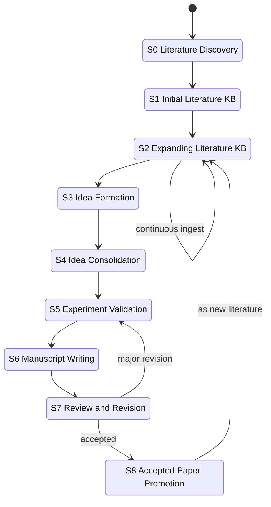

# Lifecycle &mdash; the 9-stage state machine

Research-Wiki models a research direction as a 9-stage lifecycle (S0-S8).
Every stage has an explicit directory location, a set of allowed artefacts,
and a lint rule that keeps cross-space leaks from happening.



## S0 - Literature Discovery

**Goal.** Collect an initial bag of candidate papers.

**Inputs.** Keyword searches on Google Scholar / Semantic Scholar /
OpenAlex / arXiv; survey papers; citation chaining.

**Artefacts (outside the project yet).** A `reading_queue.md` or `papers.bib`
lying around in scratch is fine; nothing needs to enter the KB at this stage.

## S1 - Initial Literature KB

**Goal.** Turn the initial bag into a navigable, minimally-lint-clean KB.

**Location.** `literature-kb/`.

**Command.** For each chosen paper: `lgrlw add-literature --manual ...`
(v0.2: also `--arxiv/--doi/--ss`). Then hand-curate the
`03_Field_Structure/` overview / problem evolution / method taxonomy and
the `05_Evidence/` evidence map.

**Lint.** `lgrlw lint` must be clean.

## S2 - Expanding Literature KB

**Goal.** Keep ingesting relevant papers as the project matures.

**Sources.** Newly-read papers; backward citations; forward citations of
core papers; reviewer-suggested literature; latest preprints on arXiv.

**Rule.** Only *external* literature may enter here. Your in-flight work
stays in a workspace.

## S3 - Idea Formation

**Goal.** Form a research hypothesis grounded in the KB.

**Location.** `research-workspaces/<idea_id>/` (kind = `idea`) or directly
a `paper` workspace if the idea is already concrete.

**Artefacts.** `01_Idea/idea_notes.md`, `01_Idea/hypotheses.md`,
`01_Idea/design_space.md`, `01_Idea/novelty_risk.md`.

## S4 - Idea Consolidation

**Goal.** Collapse the design space to one finalised idea.

**Location.** `research-workspaces/<paper_id>/00_Project/finalized_idea.md`
and `02_Idea_and_Method/`.

**Discipline.** Separate literature evidence from your own hypotheses
everywhere. See `PAPER_AGENTS.md` section 5.

## S5 - Experiment Validation

**Goal.** Validate or falsify the idea experimentally.

**Location.** `research-workspaces/<paper_id>/03_Experiments/`.

**Artefacts.** `experiment_plan.md`, `baselines.md`, `metrics.md`,
`results.md`, `analysis.md`.

**Rule.** Experimental results do **not** enter the KB. They support the
current manuscript only.

## S6 - Manuscript Writing

**Goal.** Produce the manuscript.

**Inputs.**

- `01_KB_Exports/<pack>/` &mdash; KB-grounded evidence.
- `00_Project/` + `02_Idea_and_Method/` + `03_Experiments/` &mdash; your
  contributions.

**Location.** `research-workspaces/<paper_id>/04_Writing/`.

**Discipline.** Every sentence is either **LIT** (traceable to a paper
card in the pack) or **OUR** (traceable to your experiments / method
notes). Do not mix.

## S7 - Review and Revision

**Goal.** Submit. Handle reviews. Revise.

**Location.** `research-workspaces/<paper_id>/05_Review/`.

**Rule.** Reviewer-suggested external literature may enter the KB via
`lgrlw add-literature`. Reviewer text, rebuttal drafts, revision plans,
and supplementary experiments stay in the workspace.

## S8 - Accepted Paper Promotion (v0.2)

**Goal.** Once accepted, return the paper to the KB as a first-class
literature entry.

**Command (v0.2).**

```
lgrlw promote <paper_id>
```

**Validation.** Requires `paper_status = accepted`, final title, final
author list, venue, year, DOI or arXiv, and a camera-ready artefact.

**Effect.** A new `02_Literature/Papers/<id>.md` is written (source =
`promoted`), Field-Structure / Evidence-Map / Method-Taxonomy are
updated per the `06_Promotion/add_back_to_kb_plan.md`, and a promotion
entry is appended to `00_System/log.md`.

## Why a state machine

The strict ordering and the one-way door (S7 &rarr; S8 only on
acceptance) is what makes long-horizon research KBs sustainable: without
it, "the story that supports my current paper" gradually displaces "the
state of the field".
